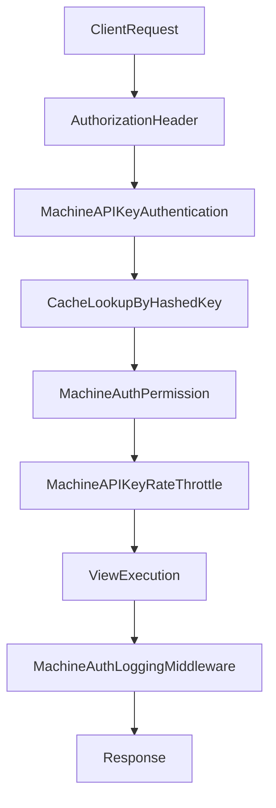

# Implement `django_machine_auth` v1.0 (Revised)

## Confirmed Decisions

- Scaffold the package from scratch in this workspace.
- Runtime checks are cache-first and permission-list based (avoid DB hit on every request).
- `MachinePermission` DB table remains authoritative for assignment validation, admin listing, and sync/docs workflows.
- `MachineAPIKey` will **not** store a `prefix` field.
- Key prefix comes from settings (`MACHINE_AUTH.KEY_PREFIX`) and defaults to `mac_`.
- Logging will support a config mode: `raw`, `redacted`, `metadata_only`.

## Planned File Targets

- Package root: `[/media/sarthak/Projects/python_package/django_machine_auth/django_machine_auth](/media/sarthak/Projects/python_package/django_machine_auth/django_machine_auth)`
- Models:
  - `[/media/sarthak/Projects/python_package/django_machine_auth/django_machine_auth/models/api_key.py](/media/sarthak/Projects/python_package/django_machine_auth/django_machine_auth/models/api_key.py)`
  - `[/media/sarthak/Projects/python_package/django_machine_auth/django_machine_auth/models/permission.py](/media/sarthak/Projects/python_package/django_machine_auth/django_machine_auth/models/permission.py)`
  - `[/media/sarthak/Projects/python_package/django_machine_auth/django_machine_auth/models/request_log.py](/media/sarthak/Projects/python_package/django_machine_auth/django_machine_auth/models/request_log.py)`
- Auth/permission flow:
  - `[/media/sarthak/Projects/python_package/django_machine_auth/django_machine_auth/authentication/api_key_authentication.py](/media/sarthak/Projects/python_package/django_machine_auth/django_machine_auth/authentication/api_key_authentication.py)`
  - `[/media/sarthak/Projects/python_package/django_machine_auth/django_machine_auth/permissions/machine_permission.py](/media/sarthak/Projects/python_package/django_machine_auth/django_machine_auth/permissions/machine_permission.py)`
  - `[/media/sarthak/Projects/python_package/django_machine_auth/django_machine_auth/utils/permission_resolver.py](/media/sarthak/Projects/python_package/django_machine_auth/django_machine_auth/utils/permission_resolver.py)`
- Registry/discovery:
  - `[/media/sarthak/Projects/python_package/django_machine_auth/django_machine_auth/decorators/module_decorator.py](/media/sarthak/Projects/python_package/django_machine_auth/django_machine_auth/decorators/module_decorator.py)`
  - `[/media/sarthak/Projects/python_package/django_machine_auth/django_machine_auth/registry/module_registry.py](/media/sarthak/Projects/python_package/django_machine_auth/django_machine_auth/registry/module_registry.py)`
  - `[/media/sarthak/Projects/python_package/django_machine_auth/django_machine_auth/apps.py](/media/sarthak/Projects/python_package/django_machine_auth/django_machine_auth/apps.py)`
- Runtime extras:
  - `[/media/sarthak/Projects/python_package/django_machine_auth/django_machine_auth/throttling/api_key_throttle.py](/media/sarthak/Projects/python_package/django_machine_auth/django_machine_auth/throttling/api_key_throttle.py)`
  - `[/media/sarthak/Projects/python_package/django_machine_auth/django_machine_auth/middleware/logging_middleware.py](/media/sarthak/Projects/python_package/django_machine_auth/django_machine_auth/middleware/logging_middleware.py)`
  - `[/media/sarthak/Projects/python_package/django_machine_auth/django_machine_auth/views/base_viewset.py](/media/sarthak/Projects/python_package/django_machine_auth/django_machine_auth/views/base_viewset.py)`
- Admin and commands:
  - `[/media/sarthak/Projects/python_package/django_machine_auth/django_machine_auth/admin/api_key_admin.py](/media/sarthak/Projects/python_package/django_machine_auth/django_machine_auth/admin/api_key_admin.py)`
  - `[/media/sarthak/Projects/python_package/django_machine_auth/django_machine_auth/management/commands/machine_auth_sync.py](/media/sarthak/Projects/python_package/django_machine_auth/django_machine_auth/management/commands/machine_auth_sync.py)`
  - `[/media/sarthak/Projects/python_package/django_machine_auth/django_machine_auth/management/commands/machine_auth_permissions.py](/media/sarthak/Projects/python_package/django_machine_auth/django_machine_auth/management/commands/machine_auth_permissions.py)`
- Packaging/docs/tests:
  - `[/media/sarthak/Projects/python_package/django_machine_auth/pyproject.toml](/media/sarthak/Projects/python_package/django_machine_auth/pyproject.toml)`
  - `[/media/sarthak/Projects/python_package/django_machine_auth/README.md](/media/sarthak/Projects/python_package/django_machine_auth/README.md)`
  - `[/media/sarthak/Projects/python_package/django_machine_auth/tests](/media/sarthak/Projects/python_package/django_machine_auth/tests)`

## Detailed Execution Plan

### Phase 1: Foundation and contracts

- Build package skeleton and import-safe `__init__.py` files for every module.
- Add `apps.py` and register startup hooks for module discovery + validation.
- Create settings helper (`utils/settings.py`) with defaults:
  - `KEY_PREFIX = "mac_"`
  - `ENABLE_REQUEST_LOGGING = False`
  - `LOGGING_MODE = "redacted"`
  - `CACHE_TIMEOUT = 3600`

### Phase 2: Models and migrations

- Implement `MachineAPIKey` fields:
  - `name`, `user`, `hashed_key`, `permissions`, `expires_at`, `is_active`, `last_used_at`, `created_at`, `updated_at`.
- Implement `MachinePermission` fields:
  - `module`, `permission`, `label`, `created_at`; unique constraint on `(module, permission)`.
- Implement `APIKeyRequestLog` with request/response metadata and timing.
- Create initial migration set and add indexes for common filters (`user`, `is_active`, `expires_at`, `module`, `permission`, `created_at`).

### Phase 3: Module system and permission registry

- Implement `@api_key_module(module_name, label=...)` decorator.
- Generate CRUD + custom action method permissions.
- Maintain global registry structure:
  - module key
  - label
  - generated permissions
  - action definition map
- Discover `<app>.api_key_perm` from each `INSTALLED_APPS` app; ignore missing module file.

### Phase 4: Auth and permission engine

- Implement key generation and hash helpers:
  - raw key format: `<prefix><random_token>`
  - hash: SHA256 only.
- Implement authentication class:
  - parse `Authorization: machine_auth <api_key>`
  - validate prefix against configured/default `KEY_PREFIX`
  - hash incoming raw key and fetch matching `MachineAPIKey`
  - check `is_active` and `expires_at`
  - cache payload under `machine_auth:key:<hashed_key>`
  - attach `request.machine_api_key`
  - update `last_used_at` asynchronously/safely on success
- Implement permission resolver:
  - default map for list/retrieve/create/update/partial_update/destroy
  - custom action map `<module>.<action>.<method_lower>`
- Implement permission class:
  - derive required permission
  - validate required permission exists in registry (configuration safety)
  - check in request key permission set and deny if absent.

### Phase 5: Viewset, throttle, and startup validation

- Implement `MachineAuthViewSet`:
  - enforce mandatory `module` attribute
  - set default authentication/permission/throttle classes.
- Implement `MachineAPIKeyRateThrottle` with `scope = "machine_api_key"` and stable key identity.
- Startup validator in `apps.py`:
  - verify module strings used by machine viewsets exist in registry
  - verify declared custom actions in viewsets are present in module action definitions
  - raise a clear custom `MachineAuthConfigurationError` for mismatches.

### Phase 6: Logging middleware and security modes

- Middleware activates only when `ENABLE_REQUEST_LOGGING=True`.
- Add `LOGGING_MODE` behavior:
  - `raw`: persist full captured request/response payloads
  - `redacted`: mask authorization and sensitive keys (`password`, `token`, `secret`, etc.)
  - `metadata_only`: persist method/url/status/timing/ip only
- Log only machine-authenticated requests to `APIKeyRequestLog`.

### Phase 7: Admin UX and validation workflow

- `MachineAPIKeyAdmin`:
  - create/edit forms with validation against `MachinePermission` table
  - grouped, searchable permission selector from DB entries
  - list filters for user, active, expired status
  - one-time raw key display upon key generation.
- `MachinePermissionAdmin`:
  - searchable `module` + `permission`, readonly timestamps.
- `APIKeyRequestLogAdmin`:
  - list by key/user/status/time, readonly detail view.

### Phase 8: Management commands

- `machine_auth_sync` command:
  - discover registry
  - compute desired vs existing DB permission set
  - create missing, delete stale, update labels
  - print per-module deterministic summary
  - optional `--dry-run`.
- `machine_auth_permissions` command:
  - print grouped docs by module label with CRUD + action permissions.

### Phase 9: Tests, packaging, and docs

- Add tests for:
  - key generation format + hashing integrity
  - auth success and failure paths (bad header, bad prefix, inactive, expired)
  - cache hit/miss path behavior
  - permission mapping and enforcement for CRUD + custom action methods
  - registry discovery with absent `api_key_perm.py`
  - sync command convergence create/delete/update
  - logging mode behavior (`raw`, `redacted`, `metadata_only`)
  - admin permission assignment validation.
- Add `pyproject.toml` metadata and dependencies (`Python>=3.9`, `Django>=3.2`, `djangorestframework>=3.13`).
- Write `README.md` with setup, module declaration, commands, middleware settings, and API usage.

## Runtime Flow (Updated)

## Acceptance Criteria

- Package installs and app loads without startup errors when configuration is valid.
- API keys are never persisted in plaintext, only SHA256 hash.
- Runtime permission checks use key permission set with cache-first behavior.
- Permission assignment rejects values absent from `MachinePermission`.
- `machine_auth_sync` makes DB permissions fully converge with module definitions.
- Logging mode is configurable and tested (`raw`, `redacted`, `metadata_only`).
- Startup validation fails fast on undefined modules/actions with actionable error messages.

## Phase 2 Hardening Todos (Execution Order)

### 1) Auth + cache integration coverage

- Create a minimal DRF test viewset inheriting `MachineAuthViewSet` under `tests/` routes.
- Add fixtures for user + API keys (`active`, `inactive`, `expired`) with hashed keys and permissions.
- Test request authentication scenarios:
  - valid key returns success and attaches machine key context
  - wrong prefix denied
  - unknown hash denied
  - inactive denied
  - expired denied
- Add cache-path tests:
  - first request populates cache
  - second request uses cache payload and still updates `last_used_at`
  - cache payload expiry branch denies when stale.

### 2) Permission engine integration coverage

- Add CRUD mapping tests:
  - `list/retrieve -> module.view`
  - `create -> module.create`
  - `update/partial_update -> module.update`
  - `destroy -> module.delete`.
- Add custom action tests for method-specific permissions (e.g. `reset_password.get`, `reset_password.post`).
- Add negative tests where:
  - API key lacks required permission
  - view module is not registered
  - custom action missing in module definition (startup validation error).

### 3) `machine_auth_sync` and `machine_auth_permissions` command hardening

- Write command tests for:
  - creating missing permission rows from registry
  - deleting deprecated DB rows not present in registry
  - updating labels when generated labels change
  - `--dry-run` producing output without DB mutation.
- Ensure output is deterministic:
  - sorted by module then permission
  - stable line prefixes (`+ Created`, `- Deleted`, `~ Updated`).
- Add docs-command tests that verify grouped module heading and full permission listing.

### 4) Logging middleware mode correctness

- Add request/response logging tests per mode:
  - `raw` keeps full payload/header snapshot
  - `redacted` masks sensitive keys (`authorization`, `password`, `token`, `secret`, `api_key`)
  - `metadata_only` stores timing/status/url/method but no bodies.
- Add tests ensuring non-machine-auth requests are skipped.
- Add tests for invalid `LOGGING_MODE` value fallback to `redacted`.

### 5) Admin UX + validation improvements

- Replace plain `MultipleChoiceField` with grouped module choices (module label headers) sourced from `MachinePermission`.
- Add admin form search helper (query filter over permission strings) for large permission sets.
- Ensure one-time key display remains create-only and cannot be recovered later.
- Add form tests verifying invalid permission submissions are rejected even when crafted manually.

### 6) Cache invalidation and consistency

- Add model/admin save hooks to invalidate cache when key permissions or status fields change.
- Add tests covering invalidation triggers on:
  - permission changes
  - `is_active` toggles
  - `expires_at` updates.
- Keep cache payload schema versioned or documented for forward compatibility.

### 7) Startup validation expansion

- Extend validation to compare extra action methods declared in viewset vs module action method list.
- Raise `MachineAuthConfigurationError` with clear remediation text:
  - include missing action name
  - include offending viewset
  - include module file hint (`<app>/api_key_perm.py`).
- Add targeted tests that assert failure conditions and message clarity.

### 8) Documentation + operational readiness

- Expand `README.md` with:
  - complete install + setup flow
  - module declaration examples
  - command usage with sample output
  - logging mode behavior table in prose
  - security and rotation recommendations.
- Add developer test instructions:
  - create venv
  - install `[test]` extras
  - run pytest command.
- Add optional CI target (e.g. `make test` or `scripts/test.sh`) for reproducible validation.

## Phase 3 Release-Readiness Todos (Execution Order)

### 1) Versioning and release policy

- Define semantic versioning policy for this package (`major.minor.patch`).
- Add a `CHANGELOG.md` with an initial `0.1.0` entry and release-note template.
- Document release cadence and what qualifies as breaking vs non-breaking.

### 2) Packaging and metadata hardening

- Validate and refine `pyproject.toml` fields:
  - classifiers
  - keywords
  - project URLs (docs/repo/issues)
  - optional dependency groups.
- Ensure source distribution and wheel include the intended package files and exclude dev-only artifacts.

### 3) Public API stability audit

- Audit package-level exports in all `__init__.py` files.
- Keep only intended public entrypoints (`MachineAuthViewSet`, decorators, auth/permission classes, commands behavior).
- Add tests guarding key import paths so refactors do not break consumers.

### 4) Example integration project

- Add a minimal sample app under `examples/` that demonstrates:
  - module declaration in `api_key_perm.py`
  - protected `MachineAuthViewSet`
  - permission assignment and sample request flow.
- Include setup instructions and a copy-paste cURL example for local verification.

### 5) Admin UX and operational polish

- Improve field help text and admin labels for clarity.
- Ensure key reveal behavior is create-only and explicitly documented in UI help.
- Add read-only protection where appropriate to reduce accidental production mistakes.

### 6) Migration and compatibility safeguards

- Add notes/tests ensuring migration compatibility across supported Django versions.
- Document safe migration path for future schema updates (including data migrations if needed).
- Add checks to avoid breaking existing DB rows when introducing new optional fields.

### 7) Documentation information architecture

- Restructure docs into clear sections:
  - Quickstart
  - Architecture
  - Permissions model
  - Operations
  - Troubleshooting.
- Add command output examples and common failure remediation steps.

### 8) Security operations playbook

- Document API key rotation strategy (periodic + emergency revoke).
- Add guidance for logging mode selection by environment.
- Add incident playbook: key compromise response and cache invalidation expectations.

### 9) CI and quality gates

- Add CI workflow (lint + tests + package build smoke check).
- Add version matrix where feasible (Python 3.9+ and supported Django/DRF ranges).
- Ensure CI fails on packaging/test regressions with clear output.

### 10) Distribution smoke checks

- Run local build for both sdist and wheel.
- Install built artifact into a clean environment and run basic import/tests.
- Verify metadata renders correctly for package index publishing.

### 11) Observability and monitoring guidance

- Document recommended counters/timers (auth success/failure, permission deny, throttle events).
- Add logging recommendations for production-safe diagnostics.
- Provide guidance for integrating with existing APM/logging stacks.

### 12) Upgrade guide for adopters

- Add `UPGRADING.md` with compatibility notes and migration checklist.
- Include notes for configuration changes and command usage updates.
- Add “deprecation policy” section for future changes.

